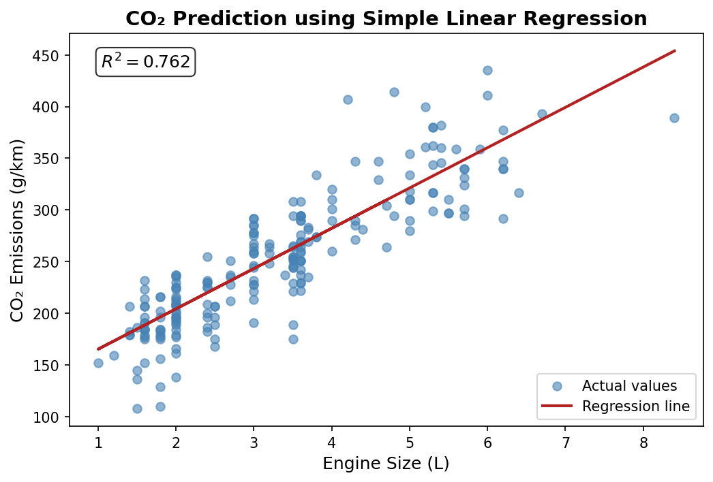

# 🚗 CO2 Emission Prediction with Simple Linear Regression

[](https://opensource.org/licenses/MIT)


 
 
 

[](https://github.com/invtaha/CO2_Emission_Prediction/commits/main)
[](https://github.com/invtaha/CO2_Emission_Prediction)
[](https://github.com/invtaha/CO2_Emission_Prediction)


> 🎯 **My first GitHub project** — A beginner-friendly machine learning project that predicts vehicle CO₂ emissions (g/km) based on engine size using Simple Linear Regression. Built for learning, open for collaboration!

## 📖 Table of Contents
- [🧠 About the Project](#-about-the-project)
- [📊 Dataset](#-dataset)
- [📁 Project Structure](#-project-structure)
- [⚙️ Requirements & Installation](#-requirements--installation)
- [🚀 Usage](#-usage)
- [📈 Results & Model Performance](#-results--model-performance-)
- [🧮 Model Details](#-model-details)
- [📉 Regression Plot](#-regression-plot)
- [🤝 Contributing](#-contributing)

## 🧠 About the Project
This project demonstrates the simplest form of machine learning
**Simple Linear Regression**
to model the linear relationship between a vehicle's **engine size** (in liters) and its **CO₂ emissions** (g/km).

### Why This Project?

- **Educational Foundation**: Simple Linear Regression is the gateway to understanding machine learning. This project is designed as a learning resource for beginners who want to see how theory translates into code.
- **Real-World Relevance**: Understanding vehicle emissions helps in environmental impact assessment and policymaking.
- **Reproducible**: Every step from data loading to model evaluation is documented and reusable.

### Key Features

- Clean, well-documented Python code
- Modular project structure (notebook + scripts)
- Trained model saved and ready for inference
- Visual regression plot for intuitive understanding
- Standard regression metrics (R², MAE, MSE)

> **Note**: This is an educational project. The model uses only one feature (engine size) and achieves moderate accuracy. For production use, consider multiple linear regression or advanced models.

<p align="right">(<a href="#-table-of-contents">back to top</a>)</p>

## 📊 Dataset

| Property | Value |
|----------|-------|
| **Source** | Public vehicle emissions dataset (Fuel Consumption Ratings from [Natural Resources Canada](https://www.nrcan.gc.ca/)) |
| **Total Samples** | 1,067 vehicles |
| **Train/Test Split** | 80% training / 20% testing (`sklearn.model_selection.train_test_split`) |
| **Target Variable** | `CO2EMISSIONS` — CO₂ emissions in grams per kilometer (g/km) |


### Features Description

| Column | Type | Description |
|--------|------|-------------|
| `MODELYEAR` | `int` | Vehicle model year (e.g., 2014) |
| `ENGINESIZE` | `float` | Engine displacement in liters (L) — **predictor** |
| `CYLINDERS` | `int` | Number of engine cylinders |
| `FUELCONSUMPTION_CITY` | `float` | Fuel consumption in city driving (L/100km) |
| `FUELCONSUMPTION_HWY` | `float` | Fuel consumption on highway (L/100km) |
| `FUELCONSUMPTION_COMB` | `float` | Combined fuel consumption (L/100km) |
| `FUELCONSUMPTION_COMB_MPG` | `int` | Combined fuel consumption in miles per gallon (MPG) |
| `CO2EMISSIONS` | `int` | CO₂ emissions (g/km) — **target variable** |


### Sample Data (First 5 Rows)

| MODELYEAR | ENGINESIZE | CYLINDERS | FUELCONSUMPTION\_CITY | FUELCONSUMPTION\_HWY | FUELCONSUMPTION\_COMB | FUELCONSUMPTION\_COMB\_MPG | CO2EMISSIONS |
|:---------:|:----------:|:---------:|:---------------------:|:--------------------:|:---------------------:|:--------------------------:|:------------:|
| 2014 | 2.0 | 4 | 9.9 | 6.7 | 8.5 | 33 | 196 |
| 2014 | 2.4 | 4 | 11.2 | 7.7 | 9.6 | 29 | 221 |
| 2014 | 1.5 | 4 | 6.0 | 5.8 | 5.9 | 48 | 136 |
| 2014 | 3.5 | 6 | 12.7 | 9.1 | 11.1 | 25 | 255 |
| 2014 | 3.5 | 6 | 12.1 | 8.7 | 10.6 | 27 | 244 |

<p align="right">(<a href="#-table-of-contents">back to top</a>)</p>

## 📁 Project Structure
```
CO2_Emission_Prediction/
│
├── data/ # Raw and processed datasets
│ └── CO2_data.csv # Main dataset (1,067 records)
│
├── images/ # Generated plots and figures
│ └── co2_regression_plot.png # Regression line vs actual data
│
├── models/ # Serialized trained models
│ └── simple_linear_model.pkl # Saved linear regression model (joblib)
│
├── notebooks/ # Jupyter notebooks for EDA & experimentation
│ └── 01_EDA_and_Model.ipynb # Exploratory Data Analysis + Model Training
│
├── src/ # Source code (production-ready scripts)
│ ├── init.py # Makes src/ a Python package
│ ├── train_model.py # Script to train and save the model
│ └── predict.py # Script to load model and make predictions
│
├── .gitignore # Files and folders ignored by Git
├── requirements.txt # Python dependencies
├── LICENSE # MIT License
└── README.md # Project documentation (this file)
```
<p align="right">(<a href="#-table-of-contents">back to top</a>)</p>

## ⚙️ Requirements & Installation

### Prerequisites

- **Python** 3.8 or higher
- **pip** (Python package installer)
- **Git** (for cloning the repository)

### Setup & Installation

1. Clone the repository
```
git clone https://github.com/invtaha/CO2_Emission_Prediction.git
```

2. Navigate to the project directory
```
cd CO2_Emission_Prediction
```

3. (Optional but recommended) Create a virtual environment
```
python -m venv venv
source venv/bin/activate        # On Windows: venv\Scripts\activate
```

4. Install required dependencies
```
pip install -r requirements.txt
```

5. Verify installation
```
python -c "import pandas, sklearn, matplotlib; print('All dependencies installed successfully!')"
```

### Required packages


| Package | Min. Version | Purpose |
|--------|--------------|----------|
| `pandas` | `1.5+`        | Data manipulation and analysis               |
| `numpy` | `1.24+`      | Numerical computing                          |
| `scikit-learn` | `1.2+`        | Machine learning (Linear Regression, metrics) |
| `matplotlib` | `3.7+`      | Data visualization                           |
| `joblib` | `1.2+`      | Model serialization                          |

<p align="right">(<a href="#-table-of-contents">back to top</a>)</p>

## 🚀 Usage

1. Train the Model
```
python src/train_model.py
```

#### What this does:

- Loads the dataset from data/CO2_data.csv

- Splits data into 80% training / 20% testing sets

- Fits a LinearRegression model on engine size vs CO₂ emissions

- Prints performance metrics (R², MAE, MSE)

- Saves the trained model to models/simple_linear_model.pkl

- Generates and saves the regression plot to images/co2_regression_plot.png

#### Expected console output:
```
Starting model training...
Dataset loaded. Shape: 1067 samples
Train: 853
Test: 214

Model Performance:
   MAE  : 24.10 g/km
   MSE  : 985.94
   R²   : 0.7616

Model saved to C:\Program Files(taha)\programming\python\ml\SLR\CO2_Emissions_Prediction\models\simple_linear_model.pkl
Plot saved to C:\Program Files(taha)\programming\python\ml\SLR\CO2_Emissions_Prediction\images\co2_regression_plot.png

Model Equation: CO2 = 126.29 + (38.99) × EngineSize

```

2. Make a Prediction
```
python src/predict.py
```

#### Example output:
```
Predicted CO₂ emission for 2.5L engine: 223.77 g/km
```

3. Run the Jupyter Notebook
#### For an interactive walkthrough including exploratory data analysis:
```
jupyter notebook notebooks/01_EDA_and_Model.ipynb
```

<p align="right">(<a href="#-table-of-contents">back to top</a>)</p>

## 📈 Results & Model Performance 

### Performance Metrics

| Metric | Value | Description |
|--------|---------|----------|
| `R² Score(Coefficient of Determination)` | `0.76`   | The model explains ~76% of the variance in CO₂ emissions — a moderate to strong fit for a single-feature model |
| `MAE (Mean Absolute Error)` | `24.09` | On average, predictions deviate from actual values by ±24.09 g/km |
| `MSE (Mean Squared Error)` | `985.93`   | Penalizes larger errors more heavily than MAE |

### Interpretation
> An R² of 0.76 means that engine size alone accounts for approximately 76% of the variability in CO₂ emissions. The remaining 24% is influenced by other factors not captured by this model (e.g., vehicle weight, fuel type, driving conditions).
This is a strong result for a simple linear regression model and demonstrates a clear linear relationship: larger engines → higher CO₂ emissions.

<p align="right">(<a href="#-table-of-contents">back to top</a>)</p>

## 🧮 Model Details

### Mathematical Formulation

#### The model follows a simple linear equation:

$$\hat{y} = \theta_0 + \theta_1 x_1$$

where:

$\hat{y}$ = predicted CO₂ emissions (g/km)

$\theta_0$ = intercept

$\theta_1$ = slope (coefficient for engine size)

$x_1$ = engine size

#### Learned Parameters
After training on the dataset:

$\theta_0$ (Intercept) ≈ 126

$\theta_1$ (Coefficient) ≈ 39

> Key Insight: A car with a 3.0L engine will emit approximately 126 + (39 × 3.0) = 243 g/km of CO₂.

#### Why Simple Linear Regression?
> Simple Linear Regression is the most fundamental starting point for learning machine learning. It establishes core concepts features, targets, coefficients, loss functions, and evaluation metrics that form the foundation for all advanced ML techniques.

<p align="right">(<a href="#-table-of-contents">back to top</a>)</p>

## 📉 Regression Plot
> The plot below shows the fitted regression line (red) against the actual data points (blue scatter). The clear upward trend confirms the positive linear relationship between engine size and CO₂ emissions.

> 

> Figure: Engine Size (L) vs CO₂ Emissions (g/km) with fitted linear regression line

<p align="right">(<a href="#-table-of-contents">back to top</a>)</p>

## 🤝 Contributing

This is a beginner-friendly educational project, but suggestions and improvements are warmly welcomed!

### To contribute:

1. Fork the repository ([invtaha/CO2_Emission_Prediction](https://github.com/invtaha/CO2_Emission_Prediction)).


2. Create a new branch:
```
git checkout -b feature/your-feature-name
```

3. Commit your changes with a descriptive message:
```
git commit -m 'Add: brief description of your improvement'
```

4. Push your branch:
```
git push origin feature/your-feature-name
```

5. Open a Pull Request — describe what you changed and why

#### Feel free to open an Issue for bugs, ideas, or questions.

### Contribution Ideas
- 🐛 Report bugs via GitHub Issues

- 💡 Suggest new features or improvements

- 📝 Improve documentation or fix typos

- 🧪 Add more models or evaluation techniques

- 🎨 Enhance visualizations


<div align="center">
⭐ If you found this project helpful, please give it a star! ⭐

Made by Taha | First GitHub Project — Many more to come!

</div>

<p align="right">(<a href="#-table-of-contents">back to top</a>)</p>
